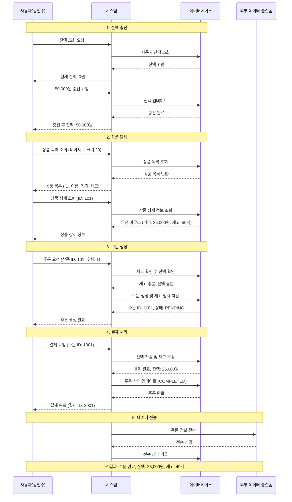
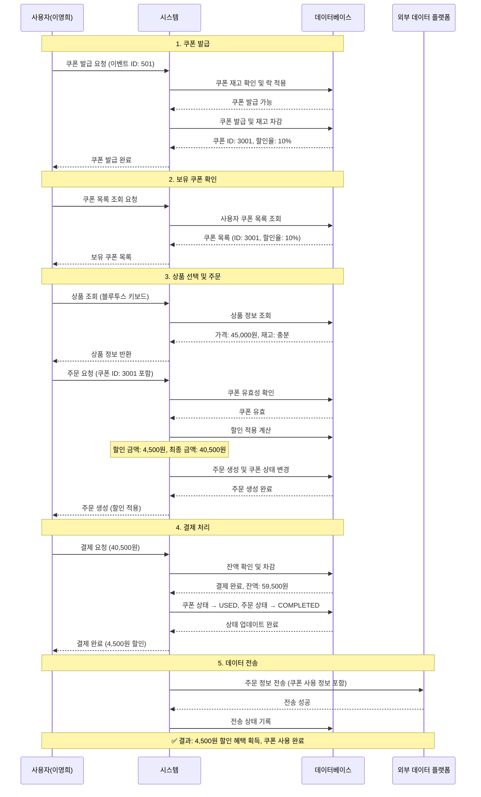
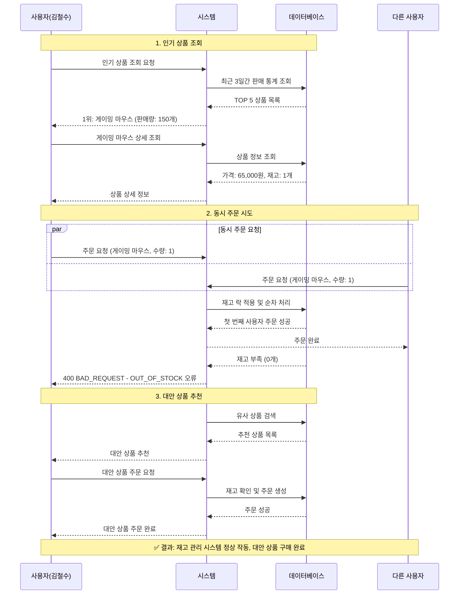
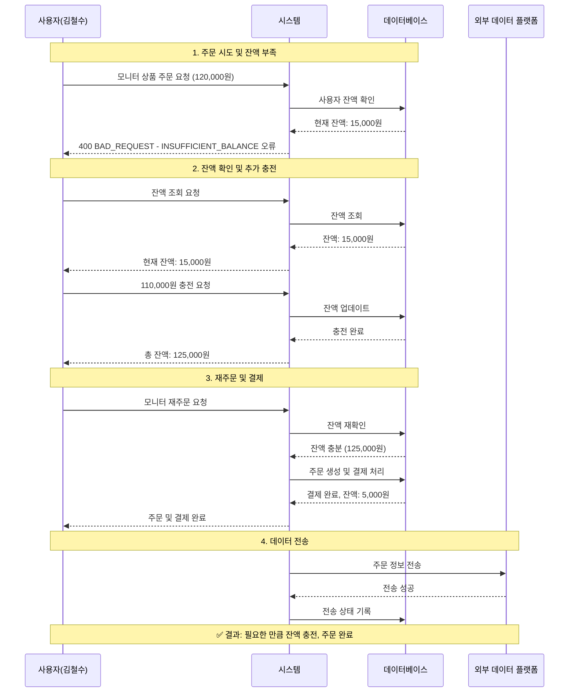
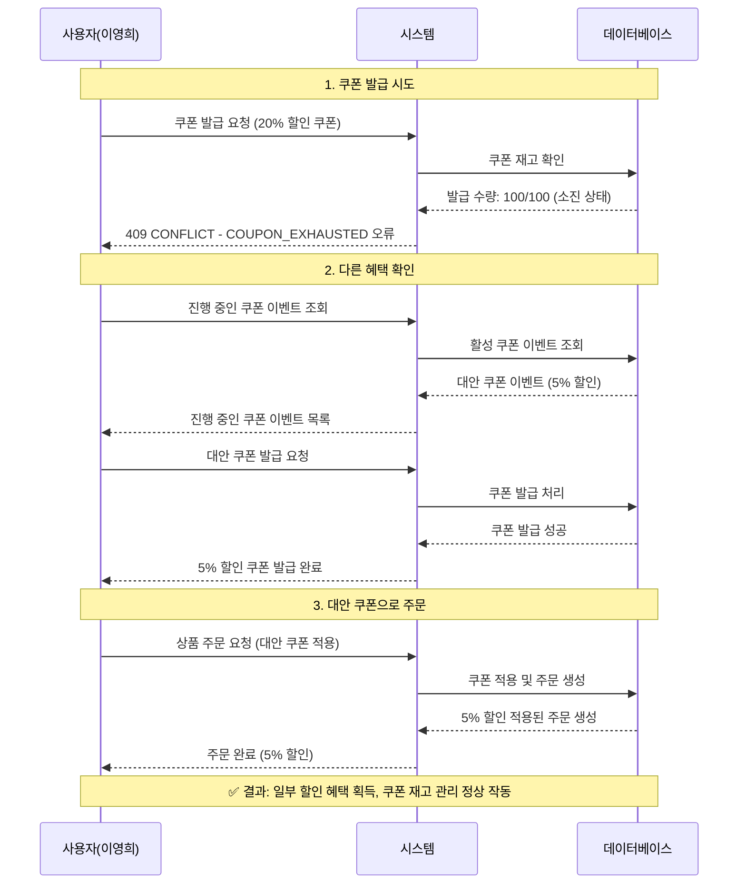
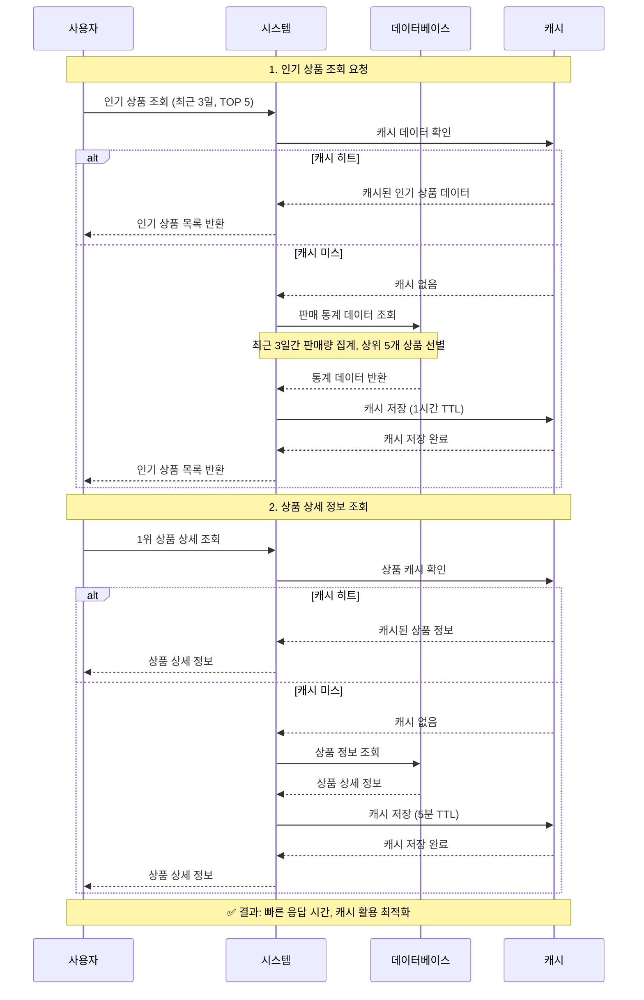
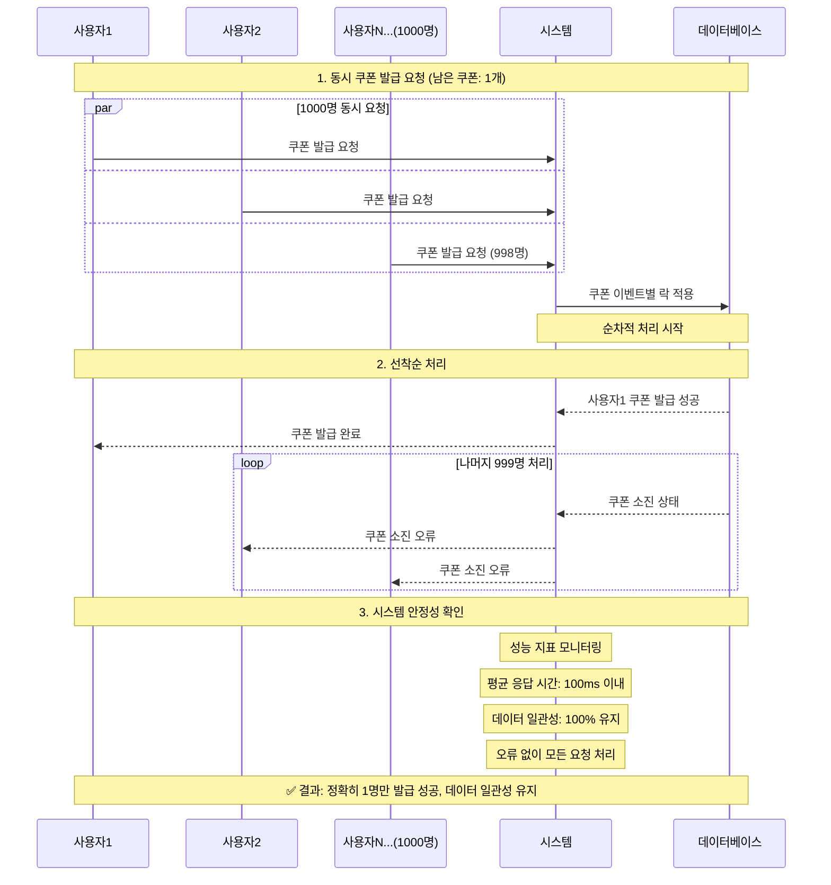
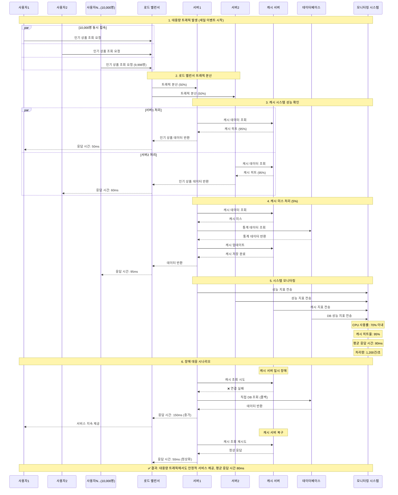
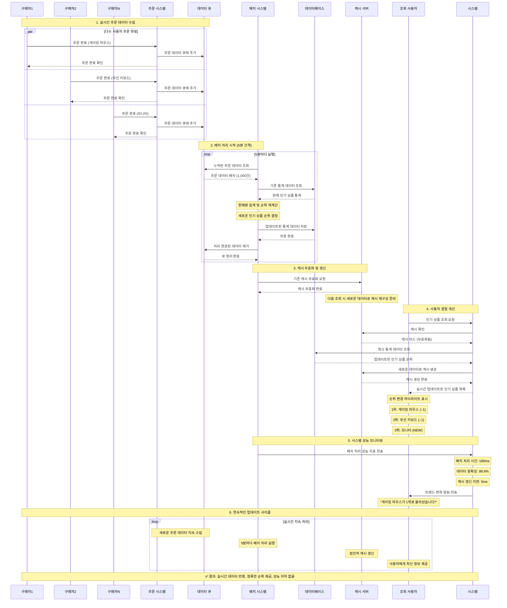
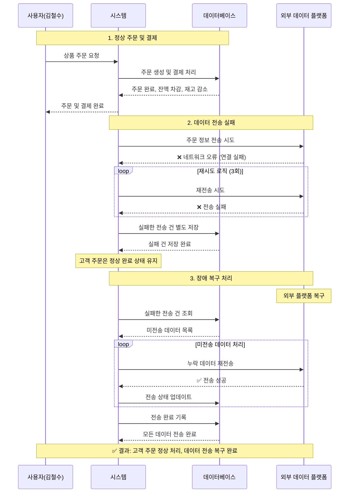

# 상품 주문 서비스 사용자 시나리오

- 시나리오를 통해 상품 주문 서비스의 주요 기능과 사용자 경험을 정의합니다.
- 각 시나리오는 특정 사용자 페르소나를 기반으로 하며, 다양한 상황에서의 행동 패턴과 시스템 반응을 포함합니다.
- 이 문서는 서비스의 기능 요구사항을 명확히 하고, 사용자 경험을 향상시키기 위한 기초 자료로 활용됩니다.

## 1. 사용자 페르소나

### 페르소나 A: 일반 구매자 (김철수)

- **특징**: 온라인 쇼핑을 자주 이용하는 직장인
- **목표**: 필요한 상품을 빠르고 편리하게 구매
- **행동 패턴**: 인기 상품 위주로 구매, 할인 쿠폰 적극 활용

### 페르소나 B: 할인 헌터 (이영희)

- **특징**: 할인 혜택을 찾아다니는 적극적인 구매자
- **목표**: 최대한 저렴하게 상품 구매
- **행동 패턴**: 선착순 쿠폰 이벤트 참여, 인기 상품 모니터링

---

## 2. 주요 사용자 시나리오

### 시나리오 1: 기본 상품 주문 (Happy Path)

#### 🎯 목표

김철수가 필요한 상품을 찾아 구매하는 기본적인 주문 과정

#### 📋 전제 조건

- 김철수는 이미 회원가입이 완료된 상태
- 시스템에 상품이 등록되어 있음
- 김철수의 잔액은 0원

#### 🚀 시나리오 흐름

1. **잔액 충전**

- 김철수가 잔액 조회 API를 호출 → 현재 잔액: 0원
- 50,000원 충전 요청
- 시스템이 충전 처리 → 잔액: 50,000원

2. **상품 탐색**

- 상품 목록 조회 API 호출 (페이지 1, 크기 20)
- 시스템이 상품 목록 반환 (상품 ID, 이름, 가격, 재고)
- 김철수가 "무선 마우스" (ID: 101, 가격: 25,000원) 선택

3. **상품 상세 조회**

- 상품 ID 101에 대한 상세 정보 조회
- 시스템이 상품 정보 반환 (재고: 50개)

4. **주문 생성**

- 주문 요청: 사용자 ID, 상품 ID 101, 수량 1개
- 시스템이 주문 가능 여부 검증 (재고 확인, 잔액 확인)
- 주문 생성 → 주문 ID: 1001, 상태: PENDING

5. **결제 처리**

- 결제 요청: 주문 ID 1001, 결제 금액 25,000원
- 시스템이 결제 처리 (잔액 차감, 재고 감소)
- 결제 완료 → 결제 ID: 2001, 상태: SUCCESS
- 주문 상태 변경 → COMPLETED

6. **데이터 전송**

- 시스템이 주문 정보를 외부 데이터 플랫폼에 전송
- 전송 성공 확인

#### ✅ 예상 결과

- 김철수의 잔액: 25,000원
- 무선 마우스 재고: 49개
- 주문 완료 및 결제 성공

---

### 시나리오 2: 선착순 쿠폰 활용 주문

#### 🎯 목표

이영희가 선착순 쿠폰을 발급받아 할인 혜택을 받으며 상품을 구매

#### 📋 전제 조건

- 이영희의 잔액: 100,000원
- 선착순 쿠폰 이벤트 진행 중 (10% 할인, 100개 한정)
- 구매 희망 상품: "블루투스 키보드" (가격: 45,000원)

#### 🚀 시나리오 흐름

1. **쿠폰 발급**

- 이영희가 쿠폰 발급 API 호출 (쿠폰 이벤트 ID: 501)
- 시스템이 쿠폰 발급 처리 → 쿠폰 ID: 3001, 할인율: 10%
- 쿠폰 상태: AVAILABLE

2. **보유 쿠폰 확인**

- 쿠폰 목록 조회 API 호출
- 시스템이 보유 쿠폰 목록 반환 (쿠폰 ID: 3001, 할인율: 10%)

3. **상품 선택 및 주문**

- 상품 조회 후 "블루투스 키보드" 선택
- 주문 생성 요청 (쿠폰 ID: 3001 포함)
- 시스템이 쿠폰 적용 처리 → 할인 금액: 4,500원, 최종 금액: 40,500원

4. **결제 처리**

- 할인 적용된 금액으로 결제 처리
- 결제 완료 → 이영희 잔액: 59,500원
- 쿠폰 상태 변경 → USED

#### ✅ 예상 결과

- 이영희가 4,500원 할인 혜택 획득
- 쿠폰 사용 완료
- 주문 및 결제 성공

---

### 시나리오 3: 재고 부족 상황

#### 🎯 목표

김철수가 인기 상품을 주문하려 하지만 재고가 부족한 상황

#### 📋 전제 조건

- 김철수의 잔액: 80,000원
- 인기 상품 "게이밍 마우스" 재고: 1개
- 동시에 여러 사용자가 같은 상품 주문 시도

#### 🚀 시나리오 흐름

1. **인기 상품 조회**

- 인기 상품 조회 API 호출
- 시스템이 최근 3일간 인기 상품 TOP 5 반환
- 1위: "게이밍 마우스" (판매량: 150개)

2. **상품 상세 조회**

- 게이밍 마우스 상세 정보 조회
- 시스템 응답: 가격 65,000원, 재고 1개

3. **주문 시도**

- 김철수가 주문 생성 요청 (수량: 1개)
- 동시에 다른 사용자도 같은 상품 주문 시도
- 시스템이 재고 락 적용하여 순서 처리

4. **재고 부족 발생**

- 첫 번째 사용자: 주문 성공
- 김철수: 재고 부족으로 주문 실패
- 시스템 응답: 400 BAD_REQUEST, 오류 코드: OUT_OF_STOCK

5. **대안 상품 추천**

- 시스템이 유사한 인기 상품 추천
- 김철수가 대안 상품 선택하여 주문 성공

#### ✅ 예상 결과

- 김철수는 원하는 상품을 구매하지 못함
- 대안 상품으로 구매 완료
- 재고 관리 시스템 정상 작동 확인

---

### 시나리오 4: 잔액 부족 상황

#### 🎯 목표

김철수가 잔액이 부족한 상황에서 추가 충전 후 주문 완료

#### 📋 전제 조건

- 김철수의 잔액: 15,000원
- 구매 희망 상품: "모니터" (가격: 120,000원)

#### 🚀 시나리오 흐름

1. **상품 선택 및 주문 시도**

- 김철수가 모니터 상품 선택 후 주문 요청
- 시스템이 잔액 확인 → 잔액 부족 감지
- 시스템 응답: 400 BAD_REQUEST, 오류 코드: INSUFFICIENT_BALANCE

2. **잔액 확인 및 추가 충전**

- 김철수가 잔액 조회 → 현재 잔액: 15,000원
- 110,000원 추가 충전 요청
- 시스템이 충전 처리 → 총 잔액: 125,000원

3. **재주문 및 결제**

- 김철수가 동일 상품으로 재주문 요청
- 시스템이 주문 가능 여부 재확인 → 통과
- 결제 처리 → 결제 금액: 120,000원
- 결제 완료 → 김철수 잔액: 5,000원

#### ✅ 예상 결과

- 김철수가 필요한 만큼 잔액 충전
- 주문 및 결제 성공
- 잔액 관리 시스템 정상 작동

---

### 시나리오 5: 쿠폰 소진 상황

#### 🎯 목표

이영희가 선착순 쿠폰 발급을 시도하지만 이미 소진된 상황

#### 📋 전제 조건

- 선착순 쿠폰 이벤트 (20% 할인, 100개 한정)
- 현재 발급된 쿠폰: 100개 (소진 상태)
- 이영희가 늦게 이벤트 참여

#### 🚀 시나리오 흐름

1. **쿠폰 발급 시도**

- 이영희가 쿠폰 발급 API 호출
- 시스템이 쿠폰 재고 확인 → 소진 상태
- 시스템 응답: 409 CONFLICT, 오류 코드: COUPON_EXHAUSTED

2. **다른 혜택 확인**

- 이영희가 다른 쿠폰 이벤트 조회
- 시스템이 진행 중인 다른 쿠폰 이벤트 정보 제공
- 대안 쿠폰 (5% 할인) 발급 성공

3. **대안 쿠폰으로 주문**

- 이영희가 대안 쿠폰을 활용하여 주문 진행
- 5% 할인 혜택으로 주문 완료

#### ✅ 예상 결과

- 원하는 쿠폰은 발급받지 못함
- 대안 쿠폰으로 일부 할인 혜택 획득
- 쿠폰 재고 관리 시스템 정상 작동

---

### 시나리오 6: 인기 상품 조회

#### 🎯 목표

김철수가 최근 인기 있는 상품들을 확인하여 트렌드를 파악하고 구매 결정에 활용

#### 📋 전제 조건

- 시스템에 최근 3일간의 판매 데이터가 충분히 축적되어 있음
- 인기 상품 통계 캐시가 1시간 TTL로 설정되어 있음
- 김철수는 로그인된 상태

#### 🚀 시나리오 흐름

1. **인기 상품 조회 요청**

- 김철수가 메인 페이지에서 "인기 상품" 섹션 클릭
- 시스템이 기본 설정으로 인기 상품 조회 (최근 3일, TOP 5)
- 캐시 확인 → 캐시 히트 시 즉시 반환
- 캐시 미스 시 DB에서 판매 통계 데이터 조회 및 집계

2. **인기 상품 목록 표시**

- 시스템이 인기 상품 목록 반환:
  - 1위: 게이밍 마우스 (판매량: 150개, 매출액: 9,750,000원)
  - 2위: 무선 키보드 (판매량: 120개, 매출액: 5,400,000원)
  - 3위: 모니터 (판매량: 80개, 매출액: 9,600,000원)
  - 4위: 웹캠 (판매량: 90개, 매출액: 2,700,000원)
  - 5위: 이어폰 (판매량: 200개, 매출액: 6,000,000원)
- 통계 기간: 2024-01-15 ~ 2024-01-17 (3일)
- 전체 판매 건수: 1,250건

3. **필터링 옵션 활용**

- 김철수가 조회 기간을 7일로 변경 요청
- 시스템이 새로운 조건으로 통계 재계산
- 업데이트된 인기 상품 목록 반환
- 캐시 업데이트 (1시간 TTL)

4. **상품 상세 정보 조회**

- 김철수가 1위 상품 "게이밍 마우스" 클릭
- 시스템이 상품 캐시 확인 (5분 TTL)
- 캐시 히트 시 즉시 상품 상세 정보 반환
- 캐시 미스 시 DB 조회 후 캐시 저장
- 상품 정보 표시: 가격, 재고, 상세 설명, 리뷰 등

5. **성능 최적화 확인**

- 시스템이 캐시 효율성 모니터링
- 인기 상품 조회 응답 시간: 50ms 이내 (캐시 히트)
- 통계 데이터 갱신 시간: 100ms 이내
- 동시 사용자 처리 능력 확인

#### ✅ 예상 결과

- 김철수가 최신 트렌드 파악 완료
- 빠른 응답 시간으로 우수한 사용자 경험 제공
- 캐시 시스템을 통한 성능 최적화 달성

### 시나리오 7: 동시성 처리 (선착순 쿠폰)

#### 🎯 목표

다수의 사용자가 동시에 마지막 쿠폰 발급을 시도하는 상황

#### 📋 전제 조건

- 선착순 쿠폰 남은 수량: 1개
- 동시에 1000명의 사용자가 쿠폰 발급 시도
- 시스템 부하 상황

#### 🚀 시나리오 흐름

1. **동시 쿠폰 발급 요청**

- 1000명이 동시에 쿠폰 발급 API 호출
- 시스템이 쿠폰 이벤트별 락 적용
- 순차적으로 요청 처리

2. **선착순 처리**

- 첫 번째 사용자: 쿠폰 발급 성공
- 나머지 999명: 쿠폰 소진으로 발급 실패
- 시스템이 일관된 응답 제공

3. **시스템 안정성 확인**

- 시스템 성능 지표 모니터링
- 응답 시간: 평균 100ms 이내 유지
- 오류 없이 모든 요청 처리 완료

#### ✅ 예상 결과

- 정확히 1명만 쿠폰 발급 성공
- 데이터 일관성 유지
- 시스템 안정성 확인

---

### 시나리오 8: 대용량 트래픽 상황에서의 인기 상품 조회

#### 🎯 목표

세일 이벤트 시간대에 대용량 트래픽이 몰렸을 때 인기 상품 조회 시스템의 안정성 확인

#### 📋 전제 조건

- 세일 이벤트로 동시 접속자 10,000명 이상
- 초당 1,000건 이상의 인기 상품 조회 요청
- 시스템 리소스 모니터링 활성화

#### 🚀 시나리오 흐름

1. **대용량 트래픽 발생**

- 세일 이벤트 시작과 동시에 대량 접속
- 다수 사용자가 동시에 인기 상품 조회
- 시스템이 캐시 히트율 90% 이상 유지
- 로드 밸런서가 트래픽 분산 처리

2. **캐시 시스템 성능 확인**

- 캐시 서버 CPU 사용률: 70% 이내 유지
- 캐시 히트율: 95% 달성
- 평균 응답 시간: 80ms 이내
- 캐시 만료 시 백그라운드 갱신 처리

3. **데이터베이스 부하 관리**

- 캐시 미스 시에만 DB 접근
- 통계 쿼리 최적화로 DB 부하 최소화
- 읽기 전용 복제 서버 활용
- 커넥션 풀 효율적 관리

4. **장애 대응 시나리오**

- 캐시 서버 일시 장애 발생
- 시스템이 자동으로 DB 직접 조회로 폴백
- 응답 시간 증가하지만 서비스 지속
- 캐시 서버 복구 시 자동 전환

#### ✅ 예상 결과

- 대용량 트래픽 상황에서도 안정적 서비스 제공
- 시스템 성능 목표 달성 (응답 시간 100ms 이내)
- 장애 상황에서도 서비스 중단 없이 운영

### 시나리오 9: 실시간 통계 업데이트

#### 🎯 목표

실시간으로 발생하는 주문 데이터를 바탕으로 인기 상품 통계를 동적으로 업데이트

#### 📋 전제 조건

- 실시간 주문 데이터 스트림 활성화
- 통계 업데이트 배치 작업 스케줄링
- 캐시 무효화 정책 설정

#### 🚀 시나리오 흐름

1. **실시간 주문 데이터 수집**

- 주문 완료 시마다 이벤트 발생
- 시스템이 주문 데이터를 통계 집계 큐에 추가
- 배치 처리를 위한 데이터 임시 저장
- 5분 간격으로 통계 데이터 갱신

2. **통계 데이터 재계산**

- 배치 작업이 주기적으로 실행
- 최근 판매 데이터 기반 순위 재계산
- 새로운 인기 상품 순위 결정
- 변경된 통계 데이터 저장

3. **캐시 무효화 및 갱신**

- 통계 업데이트 완료 시 관련 캐시 무효화
- 다음 조회 시 새로운 데이터로 캐시 재구성
- 점진적 캐시 갱신으로 성능 영향 최소화

4. **사용자 경험 개선**

- 사용자가 실시간으로 업데이트된 인기 상품 확인
- 변경된 순위 정보 하이라이트 표시
- 트렌드 변화 알림 기능 제공

#### ✅ 예상 결과

- 실시간 데이터 반영으로 정확한 인기 상품 순위 제공
- 사용자가 최신 트렌드 정보 확인 가능
- 시스템 성능 저하 없이 실시간 업데이트 달성

### 시나리오 10: 시스템 장애 상황

#### 🎯 목표

결제 처리 중 외부 데이터 플랫폼 연결 실패 시 시스템 동작

#### 📋 전제 조건

- 김철수가 정상적으로 주문 및 결제 진행
- 외부 데이터 플랫폼 장애 발생

#### 🚀 시나리오 흐름

1. **정상 주문 및 결제**

- 김철수의 주문 및 결제 정상 처리
- 잔액 차감, 재고 감소 완료

2. **데이터 전송 실패**

- 외부 데이터 플랫폼 전송 시도
- 네트워크 오류로 전송 실패
- 시스템이 재시도 로직 실행

3. **장애 복구 처리**

- 시스템이 실패한 전송 건을 별도 저장
- 외부 플랫폼 복구 시 재전송 처리
- 고객 주문은 정상 완료 상태 유지

#### ✅ 예상 결과

- 고객 주문 정상 처리
- 데이터 전송 장애가 고객 경험에 영향 없음
- 시스템 복구 시 누락 데이터 전송 완료

---

## 3. 시나리오별 성능 기준

### 응답 시간 기준

- **상품 조회**: 100ms 이내
- **잔액 조회**: 50ms 이내
- **주문/결제**: 500ms 이내
- **쿠폰 발급**: 200ms 이내

### 동시성 처리 기준

- **동시 사용자**: 10,000명 지원
- **초당 주문 처리**: 1,000건 이상
- **쿠폰 발급**: 정확한 선착순 처리

### 안정성 기준

- **시스템 가용성**: 99.9% 이상
- **데이터 일관성**: 100% 보장
- **트랜잭션 무결성**: 완전 보장

## 4. 인기 상품 조회 성능 기준

### 응답 시간 기준

- **캐시 히트**: 50ms 이내
- **캐시 미스**: 100ms 이내
- **통계 재계산**: 200ms 이내
- **대용량 트래픽**: 평균 100ms 이내

### 처리량 기준

- **동시 조회**: 10,000건/초 이상
- **캐시 히트율**: 90% 이상
- **통계 갱신**: 5분 간격
- **데이터 정확성**: 99.9% 이상

### 가용성 기준

- **시스템 가용성**: 99.95% 이상
- **캐시 장애 시 폴백**: 자동 전환
- **데이터 일관성**: 실시간 보장
- **확장성**: 수평 확장 지원
