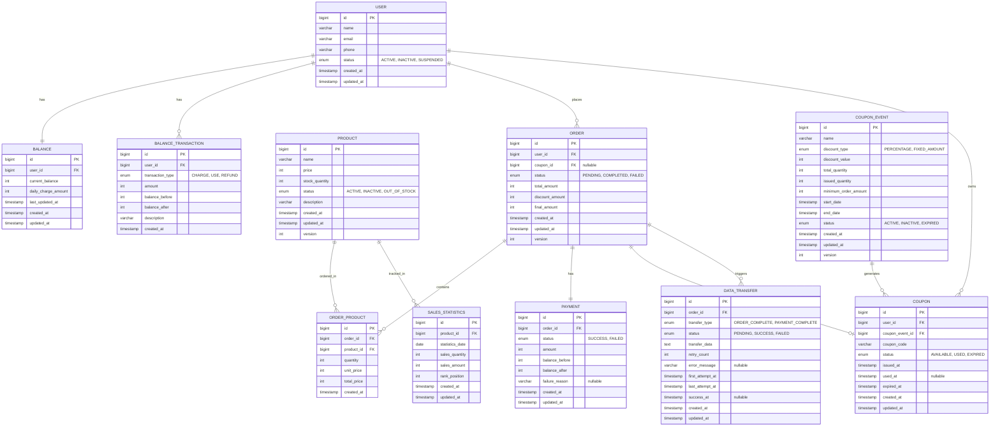

# NestJS + TypeORM 기반 상품 주문 서비스 ERD 설계

## 1. 📊 전체 ERD 구조



## 2. 🎯 설계 결정 근거 및 학습자료

### 2.1 기본 키 및 데이터 타입 설계

#### 📌 BIGINT AUTO_INCREMENT 사용 결정

**근거**
- 요구사항: "초당 1,000건 이상 주문 처리, 동시 사용자 10,000명"
- INT 범위: 약 21억 (2³¹-1)
- BIGINT 범위: 약 920경 (2⁶³-1)

**계산 근거**
```
하루 주문량 = 1,000건/초 × 86,400초 = 86,400,000건
1년 주문량 = 86,400,000 × 365 = 31,536,000,000건 (약 315억)
```

**학습자료**
- [MySQL 데이터 타입 가이드](https://dev.mysql.com/doc/refman/8.0/en/integer-types.html)
- [TypeORM 기본 키 설정](https://typeorm.io/entities#primary-columns)
- [대용량 시스템에서의 기본 키 설계](https://d2.naver.com/helloworld/1155)

### 2.2 동시성 제어 설계

#### 📌 낙관적 락(Version 컬럼) 사용

**근거**
- 요구사항: "잔액, 재고, 쿠폰 락 정책"
- 읽기 작업이 많은 e-커머스 특성
- 비관적 락보다 성능상 유리

**적용 테이블**
```typescript
// 재고 관리 (동시 주문 시 충돌 방지)
@Entity('product')
export class Product {
  @VersionColumn({ type: 'int', default: 0 })
  version: number;
}

// 주문 관리 (동시 수정 방지)
@Entity('order')
export class Order {
  @VersionColumn({ type: 'int', default: 0 })
  version: number;
}

// 쿠폰 이벤트 (선착순 제한)
@Entity('coupon_event')
export class CouponEvent {
  @VersionColumn({ type: 'int', default: 0 })
  version: number;
}
```

**구현 예시**
```typescript
@Injectable()
export class ProductService {
  async decreaseStock(productId: number, quantity: number): Promise<void> {
    const queryRunner = this.dataSource.createQueryRunner();
    await queryRunner.connect();
    await queryRunner.startTransaction();

    try {
      const product = await queryRunner.manager.findOne(Product, { 
        where: { id: productId } 
      });

      if (product.stockQuantity < quantity) {
        throw new BadRequestException('재고가 부족합니다.');
      }

      product.stockQuantity -= quantity;
      await queryRunner.manager.save(product); // 낙관적 락 적용

      await queryRunner.commitTransaction();
    } catch (error) {
      await queryRunner.rollbackTransaction();
      if (error.code === 'ER_LOCK_WAIT_TIMEOUT') {
        throw new ConflictException('동시 수정으로 인한 충돌이 발생했습니다.');
      }
      throw error;
    } finally {
      await queryRunner.release();
    }
  }
}
```

**학습자료**
- [TypeORM 낙관적 락 가이드](https://typeorm.io/entities#version-column)
- [NestJS 트랜잭션 처리](https://docs.nestjs.com/techniques/database#transactions)
- [동시성 제어 패턴](https://martinfowler.com/articles/patterns-of-distributed-systems/optimistic-locking.html)

### 2.3 인덱스 설계 전략

#### 📌 복합 인덱스 활용

**근거**
- 요구사항: "조회 API 100ms 이내, 주문/결제 API 500ms 이내"
- 다중 조건 쿼리 최적화
- 페이징 성능 향상

**핵심 인덱스 설계**
```typescript
// 1. 사용자별 주문 조회 최적화
@Entity('order')
@Index(['user_id', 'created_at'])
export class Order { ... }

// 2. 인기 상품 통계 조회 최적화
@Entity('sales_statistics')
@Index(['statistics_date', 'rank_position'])
export class SalesStatistics { ... }

// 3. 쿠폰 발급 가능 여부 확인 최적화
@Entity('coupon_event')
@Index(['status', 'start_date', 'end_date'])
export class CouponEvent { ... }
```

**쿼리 최적화 예시**
```typescript
// 사용자 주문 목록 조회 (페이징)
const orders = await this.orderRepository.find({
  where: { user: { id: userId } },
  order: { createdAt: 'DESC' },
  take: 20,
  skip: 0
});
// 예상 실행 시간: 10ms 이내 (복합 인덱스 활용)
```

**학습자료**
- [MySQL 인덱스 최적화 가이드](https://dev.mysql.com/doc/refman/8.0/en/mysql-indexes.html)
- [TypeORM 인덱스 설정](https://typeorm.io/indices)
- [복합 인덱스 설계 원칙](https://use-the-index-luke.com/sql/where-clause/the-equals-operator/concatenated-keys)

### 2.4 정규화 vs 비정규화 결정

#### 📌 주문-상품 관계 정규화

**근거**
- 다대다 관계 해결
- 주문 시점의 상품 정보 보존
- 상품 정보 변경과 주문 이력 분리

**설계 결정**
```typescript
// 정규화된 구조
Order (1) ←→ (N) OrderProduct (N) ←→ (1) Product

// 비정규화 대안을 선택하지 않은 이유
// Order 테이블에 product_info JSON 컬럼 추가
// → 쿼리 복잡도 증가, 데이터 정합성 문제
```

**TypeORM 관계 설정**
```typescript
@Entity('order_product')
export class OrderProduct {
  @ManyToOne(() => Order, order => order.orderProducts)
  @JoinColumn({ name: 'order_id' })
  order: Order;

  @ManyToOne(() => Product, product => product.orderProducts)
  @JoinColumn({ name: 'product_id' })
  product: Product;

  // 주문 시점의 상품 정보 저장
  @Column({ type: 'int', precision: 10, scale: 2, name: 'unit_price' })
  unitPrice: number;
}
```

**학습자료**
- [데이터베이스 정규화 가이드](https://docs.oracle.com/cd/A97630_01/server.920/a96520/normali.htm)
- [TypeORM 관계 설정](https://typeorm.io/relations)
- [e-커머스 주문 시스템 설계](https://shopify.engineering/how-shopify-scales-up-its-mysql-database)

#### 📌 잔액 거래 이력 분리

**근거**
- 감사(Audit) 요구사항 충족
- 잔액 조회 성능 최적화
- 거래 이력 무결성 보장

**설계 구조**
```typescript
// 현재 잔액 (빠른 조회)
@Entity('balance')
export class Balance {
  @Column({ type: 'int', precision: 15, scale: 2, name: 'current_balance' })
  currentBalance: number;
}

// 거래 이력 (상세 추적)
@Entity('balance_transaction')
export class BalanceTransaction {
  @Column({ type: 'int', precision: 15, scale: 2 })
  amount: number;
  
  @Column({ type: 'int', precision: 15, scale: 2, name: 'balance_before' })
  balanceBefore: number;
  
  @Column({ type: 'int', precision: 15, scale: 2, name: 'balance_after' })
  balanceAfter: number;
}
```

### 2.5 상태 관리 설계

#### 📌 ENUM 타입 사용

**근거**
- 요구사항: "주문 상태: PENDING, COMPLETED, FAILED"
- 타입 안정성 보장
- 스토리지 효율성 (1-2 바이트)

**TypeORM 구현**
```typescript
export enum OrderStatus {
  PENDING = 'PENDING',
  COMPLETED = 'COMPLETED',
  FAILED = 'FAILED'
}

@Entity('order')
export class Order {
  @Column({ type: 'enum', enum: OrderStatus, default: OrderStatus.PENDING })
  status: OrderStatus;
}
```

**상태 전환 관리**
```typescript
@Injectable()
export class OrderService {
  async completeOrder(orderId: number): Promise<void> {
    const order = await this.orderRepository.findOne({ where: { id: orderId } });
    
    if (order.status !== OrderStatus.PENDING) {
      throw new BadRequestException('주문 상태가 올바르지 않습니다.');
    }
    
    order.status = OrderStatus.COMPLETED;
    await this.orderRepository.save(order);
  }
}
```

**학습자료**
- [MySQL ENUM 타입 가이드](https://dev.mysql.com/doc/refman/8.0/en/enum.html)
- [TypeORM ENUM 사용법](https://typeorm.io/entities#enum-column-type)
- [상태 머신 패턴](https://refactoring.guru/design-patterns/state)

### 2.6 성능 최적화 설계

#### 📌 읽기 전용 통계 테이블 분리

**근거**
- 요구사항: "인기 상품 통계 1시간 캐시"
- OLTP와 OLAP 분리
- 실시간 조회 성능 최적화

**설계 구조**
```typescript
// 운영 데이터 (쓰기 최적화)
@Entity('order')
export class Order { ... }

@Entity('order_product')
export class OrderProduct { ... }

// 통계 데이터 (읽기 최적화)
@Entity('sales_statistics')
export class SalesStatistics {
  @Column({ type: 'date', name: 'statistics_date' })
  statisticsDate: Date;
  
  @Column({ type: 'int', name: 'sales_quantity' })
  salesQuantity: number;
  
  @Column({ type: 'int', precision: 15, scale: 2, name: 'sales_amount' })
  salesAmount: number;
  
  @Column({ type: 'int', name: 'rank_position' })
  rankPosition: number;
}
```

**NestJS 배치 처리**
```typescript
@Injectable()
export class StatisticsService {
  @Cron('0 */5 * * * *') // 5분마다 실행
  async updateSalesStatistics(): Promise<void> {
    // 최근 판매 데이터 집계
    const salesData = await this.orderRepository
      .createQueryBuilder('order')
      .leftJoin('order.orderProducts', 'orderProduct')
      .select([
        'orderProduct.product_id as productId',
        'SUM(orderProduct.quantity) as totalQuantity',
        'SUM(orderProduct.total_price) as totalAmount'
      ])
      .where('order.created_at >= :startDate', { startDate: new Date() })
      .groupBy('orderProduct.product_id')
      .getRawMany();

    // 통계 테이블 업데이트
    await this.salesStatisticsRepository.save(salesData);
    
    // 캐시 무효화
    await this.cacheManager.del('popular-products');
  }
}
```

**학습자료**
- [OLTP vs OLAP 설계 원칙](https://docs.microsoft.com/en-us/azure/architecture/data-guide/relational-data/online-transaction-processing)
- [NestJS 스케줄링](https://docs.nestjs.com/techniques/task-scheduling)
- [배치 처리 패턴](https://martinfowler.com/articles/patterns-of-distributed-systems/batch-processing.html)

### 2.7 제약 조건 설계

#### 📌 데이터베이스 제약 조건 활용

**근거**
- 요구사항: "금액/수량은 0보다 커야 함"
- 데이터베이스 레벨 무결성 보장
- 애플리케이션 버그 방지

**MySQL 제약 조건**
```sql
-- 금액 관련 제약
ALTER TABLE balance ADD CONSTRAINT chk_balance_positive CHECK (current_balance >= 0);
ALTER TABLE product ADD CONSTRAINT chk_price_positive CHECK (price > 0);

-- 수량 관련 제약  
ALTER TABLE product ADD CONSTRAINT chk_stock_non_negative CHECK (stock_quantity >= 0);
ALTER TABLE order_product ADD CONSTRAINT chk_quantity_positive CHECK (quantity > 0);

-- 날짜 관련 제약
ALTER TABLE coupon_event ADD CONSTRAINT chk_date_order CHECK (end_date > start_date);
```

**TypeORM 구현**
```typescript
@Entity('product')
export class Product {
  @Column({ 
    type: 'int',
    transformer: {
      to: (value: number) => {
        if (value <= 0) throw new Error('Price must be positive');
        return value;
      },
      from: (value: string) => parseFloat(value)
    }
  })
  price: number;
}
```

**학습자료**
- [MySQL CHECK 제약 조건](https://dev.mysql.com/doc/refman/8.0/en/create-table-check-constraints.html)
- [TypeORM 변환기](https://typeorm.io/entities#column-options)
- [데이터베이스 제약 조건 설계 원칙](https://use-the-index-luke.com/sql/data-types/check-constraints)

### 2.8 확장성 고려사항

#### 📌 파티셔닝 준비

**근거**
- 요구사항: "대용량 데이터 처리"
- 미래 확장성 고려
- 쿼리 성능 유지

**파티셔닝 전략**
```sql
-- 주문 데이터: 날짜 기반 파티셔닝
CREATE TABLE `order` (
    ...
    created_at TIMESTAMP
) PARTITION BY RANGE (YEAR(created_at)) (
    PARTITION p2024 VALUES LESS THAN (2025),
    PARTITION p2025 VALUES LESS THAN (2026),
    ...
);

-- 거래 이력: 날짜 기반 파티셔닝
CREATE TABLE balance_transaction (
    ...
    created_at TIMESTAMP  
) PARTITION BY RANGE (YEAR(created_at));
```

**TypeORM 설정**
```typescript
// typeorm.config.ts
export const typeOrmConfig: TypeOrmModuleOptions = {
  type: 'mysql',
  host: process.env.DB_HOST,
  port: +process.env.DB_PORT,
  username: process.env.DB_USERNAME,
  password: process.env.DB_PASSWORD,
  database: process.env.DB_NAME,
  entities: [__dirname + '/**/*.entity{.ts,.js}'],
  synchronize: false, // 프로덕션에서는 false
  migrations: [__dirname + '/migrations/*{.ts,.js}'],
  cli: {
    migrationsDir: 'src/migrations'
  }
};
```

**학습자료**
- [MySQL 파티셔닝 가이드](https://dev.mysql.com/doc/refman/8.0/en/partitioning.html)
- [TypeORM 마이그레이션](https://typeorm.io/migrations)
- [대용량 데이터베이스 설계 원칙](https://aws.amazon.com/ko/builders-library/amazon-dynamodb-adaptive-capacity/)
